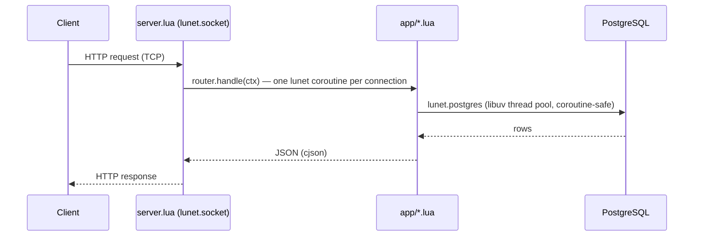

# 

> Lua codebase containing real world examples (CRUD, auth, advanced patterns, etc) that adheres to the [RealWorld](https://github.com/realworld-apps/realworld) spec and API.

### [Demo](https://demo.realworld.build/)&nbsp;&nbsp;&nbsp;&nbsp;[RealWorld](https://github.com/realworld-apps/realworld)

This codebase demonstrates a fully fledged backend API built with **[lunet](https://github.com/lua-lunet/lunet)** (a libuv + LuaJIT coroutine networking runtime) and **PostgreSQL**, including CRUD operations, JWT authentication, routing, and no framework beyond a small router. It passes the RealWorld API compatibility suite (`specs/run-api-tests-hurl.sh`).

## How it works



- **lunet**: standalone libuv + LuaJIT runtime — no nginx, no OpenResty; `server.lua` runs its own accept loop with `lunet.socket`, spawning one coroutine per connection
- **lunet.postgres**: native PostgreSQL driver built on libpq; queries run on libuv's thread pool so a slow query never blocks the event loop
- **lib/crypto.lua**: libsodium via LuaJIT FFI — Argon2id password hashing, HMAC-SHA256 for JWT signing, base64url, CSPRNG
- **cjson**: JSON encoding/decoding
- **Custom router** ([app/router.lua](app/router.lua)): a small routing table with `:param` extraction, driven by a per-request context object ([compat/ngx_context.lua](compat/ngx_context.lua)) rather than a global — safe under concurrent coroutines
- **Custom HTTP parsing** ([lib/http.lua](lib/http.lua)): request/response (de)serialization over raw sockets

## Project structure

```
├── Makefile               # init, start, stop, test, lint, clean
├── server.lua              # Entry point: lunet accept loop, dispatches to router
├── index.html               # Landing page
├── app/
│   ├── router.lua          # Routing table, JSON response handling
│   ├── routes.lua          # Route registration
│   ├── auth_routes.lua     # /api/users, /api/user
│   ├── article_routes.lua  # /api/articles, comments, favorites, tags
│   ├── profile_routes.lua  # /api/profiles
│   ├── web.lua             # Shared helpers (auth token resolution, responses)
│   ├── db.lua              # SQL queries via lunet.postgres
│   ├── jwt.lua              # HS256 JWT encode/decode, built on lib/crypto
│   ├── password.lua        # Argon2id hashing, built on lib/crypto
│   ├── config.lua          # Environment variable resolution
│   └── dotenv.lua          # .env file loader
├── lib/
│   ├── crypto.lua          # libsodium FFI: hashing, HMAC, base64, CSPRNG
│   └── http.lua            # HTTP request parsing / response building
├── compat/
│   └── ngx_context.lua     # Per-connection request context passed into router.handle()
├── bin/                     # Vendored lunet binaries (lunet-run, lunet.so, driver .so files)
├── sql/schema.sql          # PostgreSQL schema
├── specs/                  # RealWorld Hurl compatibility suite + OpenAPI spec
└── target/                 # Runtime files: pid, logs, local Postgres data dir (gitignored)
```

All runtime state (pid file, logs) lives under `target/`, so the working tree stays clean. `make clean` empties it (and refuses to run while the server is up).

## Getting started

Requires PostgreSQL and [mise](https://mise.jdx.dev/) (which provides hurl and lua-language-server). The `bin/` directory ships prebuilt lunet binaries for macOS (from the [lunet releases](https://github.com/lua-lunet/lunet/releases)); the PostgreSQL driver (`bin/lunet/postgres.so`) isn't in lunet's release tarballs and is built from source — see [Building lunet-postgres](#building-lunet-postgres) if you need to rebuild it for a different platform.

```bash
cp .env.example .env   # or create .env with PGHOST, PGPORT, PGDATABASE, PGUSER, PGPASSWORD, JWT_SECRET

make init      # check dependencies, load sql/schema.sql
make start     # start the server on port 8081
make test      # run the RealWorld API compatibility suite (Hurl)
make load-test # read-dominated load test with hey, concurrency doubling 1 -> 64
make lint      # lua-language-server static analysis
make stop      # stop the server
make clean     # remove runtime files in target/
```

## Building lunet-postgres

lunet's release tarballs only ship the SQLite3 driver; the PostgreSQL driver is a separate `xmake` target built from the [lunet](https://github.com/lua-lunet/lunet) source:

```bash
git clone https://github.com/lua-lunet/lunet /tmp/lunet-src
cd /tmp/lunet-src
export PKG_CONFIG_PATH="$(pkg-config --variable=libdir libpq)/pkgconfig:$PKG_CONFIG_PATH"  # if libpq is keg-only
xmake f -m release --lunet_trace=n --lunet_verbose_trace=n -y
xmake build lunet-postgres
# copy build/<platform>/<arch>/release/lunet/postgres.so to bin/lunet/postgres.so
```

## Docker

The image is pure lunet — no nginx, no OpenResty. A builder stage compiles the whole lunet
stack (core, sqlite3 and postgres drivers) from source via `xmake` for whatever platform is
building, plus `cjson` via luarocks; the runtime stage only carries the shared libraries those
binaries link against.

```bash
docker build -t realworld-lua .

docker run --rm -p 8081:8081 \
  -e PGHOST=... -e PGPORT=5432 -e PGDATABASE=realworld -e PGUSER=... -e PGPASSWORD=... \
  -e JWT_SECRET=... \
  realworld-lua
```

lunet refuses to bind a listening socket to a non-loopback address unless told the container
boundary is the intended security perimeter, so the image's `CMD` passes
`--dangerously-skip-loopback-restriction` to `lunet-run` — required for the standard
`-p containerPort:hostPort` pattern, since the server has to listen on `0.0.0.0` inside the
container for the port mapping to reach it.

## Load testing

`make load-test` runs [specs/run-load-tests.sh](specs/run-load-tests.sh) (POSIX sh, requires
[hey](https://github.com/rakyll/hey)): readers hammer the article list and detail endpoints at
full speed with concurrency doubling 1 → 64, while writers post comments and favorites at a
limited rate, keeping the mix ~99% reads. The test fails on any HTTP 500. Note: `server.lua`
does not yet implement connection/load shedding (nginx's `limit_conn` did this in the previous
OpenResty deployment) — under sustained overload it will queue rather than return 503.

## License

[MIT](LICENSE)
