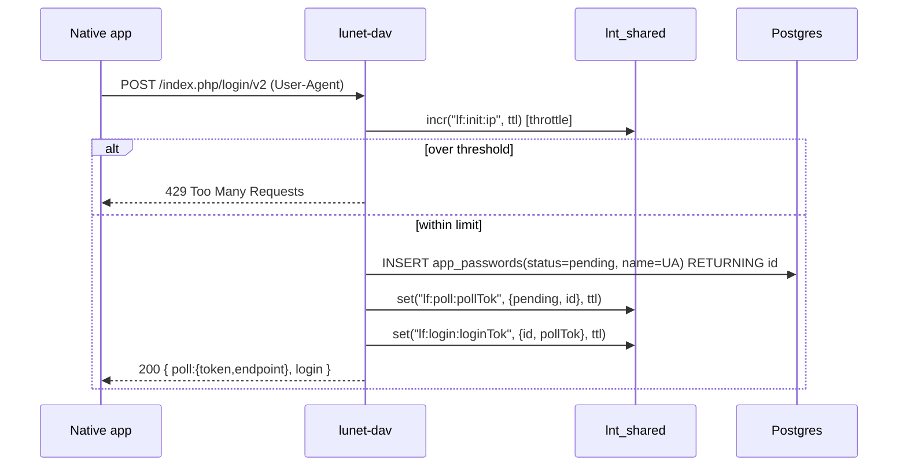
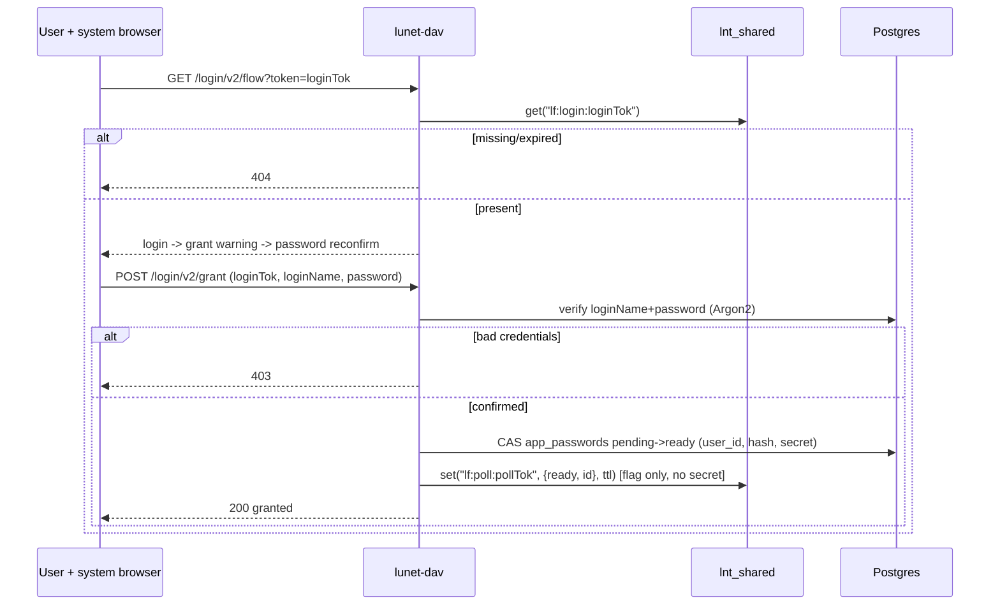
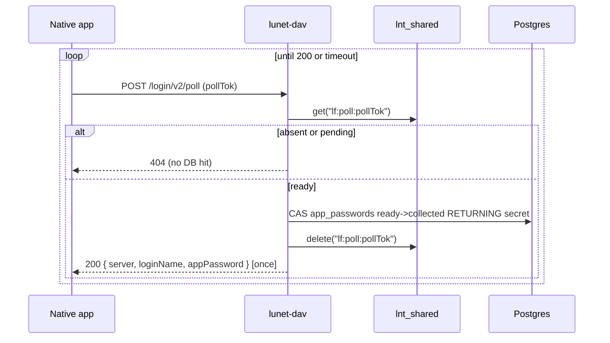

# lunet-dav — Design

A WebDAV server that is a **work-alike** to the file APIs of NextCloud Enterprise 31
(hereafter **nc**), backed by an S3-compatible object store and PostgreSQL 16 for
metadata. Built on the `lunet` (libuv + LuaJIT coroutine) runtime.

Its purpose: a **local integration simulator** for iOS / Android / Flutter desktop
clients being developed against a real nc E31 instance, so those clients can be tested
offline against a faithful subset of the nc WebDAV surface. No authentication is
enforced on the DAV surface in v0.1.0 (see §10).

---

## 1. Goals & non-goals

**Goals**
- Faithful nc E31 WebDAV *wire behaviour* for the MVP method set: `OPTIONS`, `PROPFIND`,
  `PUT`, `GET`, `HEAD`, `DELETE`, `MKCOL`, `MOVE`, `PROPPATCH` (tags only).
- Emit the nc-specific response headers clients key off: `OC-Etag`, `OC-FileId`
  (`<padded-id><instance-id>`), `X-OC-MTime: accepted`, `X-Hash-SHA256`.
- Content-addressed, **immutable** object storage with **mandatory** S3 versioning.
- One DAV personality only: nc E31. Configurability covers the *upstream* S3 profile,
  integrity cross-checks, and optional extra response headers — never a second DAV
  dialect (see §6–§8).
- Metadata in Postgres with **compare-and-swap (CAS)** concurrency (no multi-statement
  transactions available in the driver) and an append-only op-log.

**Non-goals for v0.1.0** (deliberately *not* boiling the ocean)
- Users / owners / permissions / ACLs / sharing / federation.
- Favourites (needs a user table), comments, locks, previews, quotas (report unlimited).
- Chunked / streaming upload (the landing prefix is designed for it, but not exposed).
- Nested folders. **Only flat, top-level collections** ("team folders") are allowed.
- `COPY` (would create two logical files with one sha256 — unsupported by design).
- Folder zip/tar download, `REPORT`, public shares.

---

## 2. Storage model

### 2.1 Object store (S3)
- **Versioning is mandatory and non-negotiable.** On startup the server asserts that the
  configured bucket has versioning `Enabled`; it refuses to run otherwise. This is not
  configurable: it gives an immutable-semantics store and a get-out-of-jail for
  accidental overwrites.
- **Content-addressed keys.** A file's bytes are hashed locally with **SHA-256**; the
  lowercase hex digest is the object key. The hash is therefore *not* optional — it is
  the addressing scheme and the dedup mechanism, and it surfaces as `X-Hash-SHA256` and
  `oc:checksums` for free. Before uploading, the server reuses a matching locator from
  live metadata or the retained object returned by `HeadObject`; identical content
  collapses to one retained object version.
- **Landing prefix.** All PUTs land under a reserved prefix (default `_landing/`,
  configurable via `S3_LANDING_PREFIX`), e.g. `_landing/<sha256>`. This is the seam
  where future chunked upload will stream, followed by a server-side move into a named
  team-folder prefix. **Not exposed** in v0.1.0.
- **Immutability with an escape hatch.** Objects are treated as immutable, with the
  right reserved to overwrite-in-place for accident recovery; the S3 **VersionId** is
  the escape hatch and future version-history surface.

### 2.2 Internal identity vs. nc external identity
Two distinct identifiers, do not conflate:

| Concept              | Value                                   | Used for |
|----------------------|-----------------------------------------|----------|
| **Storage locator**  | `bucket + key(sha256) + s3_version_id`  | fetching exact bytes; immutable version pin |
| **nc file identity** | `files.id` (BIGSERIAL) → `OC-FileId`    | stable inode-like id, survives content change |

`OC-FileId = lpad(id::text, DAV_FILEID_PAD_WIDTH, '0') || DAV_INSTANCE_ID`, mirroring
the observed nc format `00000259oczn5x60nrdu`. `id` is a per-instance monotonic counter
over all files and folders. It is **stable across content overwrites and moves** — an
overwrite changes the bytes, sha256, S3 version, etag and mtime, but keeps the same
`id`/`OC-FileId`, exactly like an inode.

### 2.3 ETag
nc etags are opaque quoted strings. We store the S3-returned ETag of the object version
(for single-part PUTs this is the MD5 of the bytes) as `files.etag` and emit it quoted
as `OC-Etag`. It is opaque to clients; content identity is really carried by sha256.
No extra hashing, stable per content, and a genuine store-side value rather than an
invented one.

---

## 3. PostgreSQL metadata

No client-side multi-statement transactions are used (the `lunet.postgres` driver runs
each `query` independently on the libuv thread pool). Correctness therefore rests on
**single-statement CAS updates** with a version guard and `RETURNING`.

### 3.1 `dav_files` table (see [`../sql/dav_schema.sql`](../sql/dav_schema.sql))
- `id BIGSERIAL PRIMARY KEY` — drives `OC-FileId`; stable identity.
- `is_collection BOOLEAN` — true for a top-level folder (MKCOL), false for a file.
- `collection TEXT` — the top-level team folder name, or `''` for the root.
- `name TEXT` — display name / filename.
- `UNIQUE (collection, name)` — logical path uniqueness (flat namespace).
- `sha256 TEXT` — content hash = object key basename (NULL for collections).
- `s3_bucket`, `s3_key`, `s3_version_id TEXT` — the storage locator.
- `etag TEXT` — S3 ETag, emitted as `OC-Etag`.
- `mime_type TEXT`, `size BIGINT`.
- `version INTEGER NOT NULL DEFAULT 0` — **CAS guard**, bumped on every metadata write.
- `ctime TIMESTAMPTZ DEFAULT now()`, `mtime TIMESTAMPTZ DEFAULT now()` — server-set;
  `mtime` returned by the CAS `RETURNING` clause so callers learn the new value.
- `info JSONB DEFAULT '{}'` — carries the op-log, the materialized tag set, and the
  harvested upstream metadata, all under the same CAS (§3.3, §6.2).

### 3.2 CAS write pattern
Every mutation reads the current `version`, then:

```sql
UPDATE dav_files
   SET version    = version + 1,
       sha256     = $2, s3_key = $3, s3_version_id = $4, etag = $5,
       size       = $6, mime_type = $7,
       mtime      = now(),
       info       = $8::jsonb
 WHERE id = $1 AND version = $expected
RETURNING id, version, mtime, etag;
```

Zero rows affected ⇒ someone else won the race ⇒ surface as `412 Precondition Failed`
(and/or bounded retry). New files are `INSERT ... RETURNING`.

### 3.3 The op-log and tags (inside `info` JSONB)
`info.oplog` is an append-only JSON array of four-element rows:

```
[ ts, who, type, data ]
```

- `ts`   — unix epoch (seconds) of the op, as text.
- `who`  — user performing the write (Basic-auth username; `anonymous` in v0.1.0).
- `type` — op kind: `put`, `mkcol`, `move`, `set-label`, `unset-label`, `rename`.
- `data` — the value that was set (new sha256, destination path, label value, …).

Rows are appended inside the same CAS statement as the metadata write, so the op-log
and the version bump are atomic in one statement. The array is *unbounded in theory*
but bounded in practice (metadata ops only; can be capped in prod).

**Tags.** `info.tags` holds the materialized tag set for the resource. A PROPPATCH tag
update folds the requested set against the stored set, appends the diff as
`set-label`/`unset-label` ops (so the op-log remains the audit trail of how the set
was reached), and stores the new set — all in one CAS write.

**Upstream metadata.** `info.upstream` holds metadata harvested from the object store
(see §6.2), e.g. `{ "checksum_sha256": "...", "stored_at": "..." }`.

---

## 4. Namespaces & the private `lnt` namespace

We honour the nc namespace prefixes exactly (`d`, `oc`, `nc`, `ocs`, `ocm`) so client
XML round-trips. We add a **private** namespace for debugging:

- URI `http://lunet.stenographer.cloud/ns`, prefix **`lnt`**.
- Exposes internal state in PROPFIND: `lnt:sha256`, `lnt:s3-version-id`,
  `lnt:cas-version`, `lnt:collection`, `lnt:oplog` (the full op-log serialised as a
  JSON array of `[ts,who,type,data]` rows), and `lnt:upstream-checksum` when upstream
  metadata has been harvested (§6.2).
- **Not a stable API.** Explicitly for debugging; may change or vanish.

---

## 5. Path & namespace rules (flat team folders)

- Base: `/remote.php/dav/files/{user}/...`. `{user}` is taken from Basic auth / path;
  not validated in v0.1.0.
- **Flat only.** A collection is a single top-level segment. Paths of the form
  `/{collection}/{file}` or `/{file}` are allowed; anything deeper is rejected `409`.
- **Reserved prefix.** Names beginning with `_` are reserved for the system
  (the landing prefix, future system folders) → `MKCOL` rejected `403`.
- **No slashes in folder names**, no nesting.
- **`COPY` unsupported.** Copying a file would mean two logical rows sharing one
  sha256, which the content-addressed model does not represent → `409 Conflict` with
  a DAV error body, documented as intentional.

---

## 6. S3 compatibility profiles

`S3_API_PROFILE` selects an **API profile**: a capability table describing what the
upstream object store supports, so the server can run in a "fewer features" mode
against old/limited S3 gateways (e.g. legacy SAN/NAS S3 front-ends) and light up
integrity features against modern ones.

### 6.1 Profiles

| Capability                                  | `lcd` (default) | `minio`, `minio-enterprise` |
|---------------------------------------------|-----------------|-----------------------------|
| `PutObject` / `GetObject` / `HeadObject` / `GetBucketVersioning` | yes | yes |
| SigV4, path-style addressing                | yes             | yes |
| Send `x-amz-checksum-sha256` on PUT         | no              | yes |
| Harvest `x-amz-checksum-sha256` from responses | no           | yes |
| HeadObject follow-up to fill missing checksum | no            | yes |

- `lcd` — the lowest common denominator: only the classic, universally supported
  operations. Wire behaviour with the upstream is exactly the classic SigV4 exchange.
- `minio`, `minio-enterprise` — currently share one capability set (modern checksum
  support). They are distinct names so that future per-vendor divergence has a seam;
  an operator declares what the upstream *is*, and the server uses only what that
  profile advertises.

Features deliberately **gated out of every profile** for now: Object Lock / retention,
object tagging, `ListObjectVersions` pagination niceties, anything requiring a vendor
admin API, virtual-host-style addressing, TLS to upstream. Versioning enforcement uses
`GetBucketVersioning`, available even on legacy gateways; if a gateway cannot report
`Enabled`, startup fails — document the gateway as unsupported.

Outbound HTTPS to the upstream object store is deferred to a TLS-terminating sidecar
(nginx/caddy/openresty, TBD) or a future native client; the S3 client speaks plain
HTTP only.

### 6.2 Integrity cross-check & upstream metadata harvest

Under a checksum-capable profile the PUT flow becomes:

1. sha256 is computed locally (it is the object key — always).
2. `PutObject` carries `x-amz-checksum-sha256: <base64>`; the upstream **verifies the
   transfer** and rejects on mismatch (a corruption-in-transit alarm between lunet-dav
   and the object store, which local hashing alone cannot provide).
3. The checksum returned in the `PutObject` response is harvested. If the profile
   advertises checksum support but the response omits it, a single `HeadObject`
   follow-up (a coroutine-suspended round trip; it blocks no other request) fetches
   it. `HeadObject` under a capable profile carries `x-amz-checksum-mode: ENABLED` —
   the value is case-sensitive upstream, and without it the checksum is withheld even
   when stored.
4. Harvested values are persisted in `dav_files.info.upstream` under the same CAS as
   the rest of the write, and are available to the response-header policy (§8). On the
   content-reuse path (locator from metadata or a retained object) the persisted
   checksum rides along; a locator still lacking one (e.g. content stored while
   running `lcd`, which stores no upstream checksum at all) is healed by the same
   `HeadObject` follow-up when the object has a checksum to report.

Under `lcd` none of this happens: no extra request headers, no follow-up, zero cost.

---

## 7. Behavior configuration

Runtime behaviour is governed by a **layered configuration**: a Lua defaults table in
`app/behavior.lua`, overlaid by `.env` (via dotenv), overlaid by real environment
variables. Resolution happens once at startup; unknown keys are rejected.

| Key | Values | Default | Effect |
|-----|--------|---------|--------|
| `DAV_INSTANCE_ID` | string | `oczn5x60nrdu` | instance-id suffix of `OC-FileId` |
| `DAV_FILEID_PAD_WIDTH` | integer 1–32 | `8` | zero-pad width of the numeric `OC-FileId` portion |
| `S3_LANDING_PREFIX` | string | `_landing/` | object-key prefix for uploads |
| `S3_API_PROFILE` | `lcd` \| `minio` \| `minio-enterprise` | `lcd` | upstream capability profile (§6) |
| `DAV_EMIT_HASH_HEADER` | `on-request` \| `always` \| `never` | `on-request` | when `X-Hash-SHA256` appears on PUT responses (§8) |
| `DAV_PUT_PASSTHROUGH_HEADERS` | comma-list of upstream header names | *(empty)* | upstream response headers copied verbatim onto PUT responses (§8) |

Defaults are exactly the historical behaviour, so an unconfigured server is
wire-identical to the compat contract in `specs/`.

---

## 8. Response header policy

PUT (and MKCOL/MOVE) success responses carry a fixed nc-compatible core plus
config-gated extras:

**Always emitted (the nc contract):**
- `OC-FileId` — stable inode-like identity (§2.2).
- `OC-Etag` / `ETag` — the stored S3 ETag, quoted.
- `X-OC-MTime: accepted` / `X-OC-CTime: accepted` — echoed when the request carries
  `X-OC-MTime` / `X-OC-CTime` (server timestamps remain authoritative).

**Mapped (config-gated):**
- `X-Hash-SHA256` — the content sha256. `DAV_EMIT_HASH_HEADER=on-request` (default):
  only when the request carries `X-Hash: sha256`. `always`: unconditional. `never`:
  suppressed. The value is always the locally computed hash (it is the object key);
  the upstream checksum, when harvested, is a cross-check of the same bytes, never a
  substitute.

**Pass-through (admin allowlist, default empty):**
- Any upstream header named in `DAV_PUT_PASSTHROUGH_HEADERS` (e.g.
  `x-amz-version-id`, `x-amz-checksum-sha256`) is copied verbatim from the harvested
  upstream response onto the PUT response. Names that were not harvested (absent under
  the active profile) are silently skipped. Empty by default: out of the box the server
  leaks nothing about the upstream and stays byte-identical to the nc wire contract.

An operator who knows their clients never read extra headers leaves the allowlist
empty and pays nothing; an operator debugging an upstream integration opts in
explicitly.

---

## 9. Deployment & network posture

- The server binds `LUNET_HOST`:`LUNET_PORT` directly. Run it on **loopback or a unix
  socket** and front it with nginx/OpenResty in production; bind posture is the
  operator's concern.

---

## 10. Security (v0.1.0)

- The DAV surface itself is **unauthenticated** in v0.1.0: the Basic-auth header is
  parsed and the username seeds `oplog.who`, but the password is **not** validated.
  This build is a local simulator by design.
- **We keep the chassis's user-security machinery** — the `users` table, Argon2
  password hashing (`app/password.lua`), JWT issue/verify (`app/jwt.lua`), and the
  register/login/current-user endpoints (`app/auth_routes.lua`) — as the basis for
  protecting the DAV logic once the core WebDAV behaviour is complete.
- **Tags live in `dav_files.info`** (§3.3), not a separate table, so tag writes ride
  the same single-row CAS as every other mutation.
- The `comments` table is **retained but decoupled** (its `article_id` column has no
  FK) as a placeholder — nc E31 has file comments we do not implement yet. It has no
  live routes until a file-comments model is built.
- Future: DAV requests gated by JWT verification at the same seam
  `web.get_current_user` occupies in the chassis, plus an IdP / app-password
  integration.

---

## 11. Testing strategy

- **Red/Green TDD compat suite** in `specs/**/*.hurl` — Hurl 8.x against a running
  server. These files are the compatibility contract; a feature is done when its hurl
  file goes green. Tests assert nc wire behaviour: status codes, `OC-Etag`/`OC-FileId`
  shapes, `207` multistatus XML (matched via `xpath` `local-name()` to sidestep
  namespace binding), tag folding, and the `lnt:` debug output.
- **Unit tests** — busted, `spec/unit/*_spec.lua`, pure Lua (no DB/S3/socket; fakes at
  the seams). Full inventory in [`TEST-PLAN.md`](TEST-PLAN.md).
- **`make e2e`** — fully automated: ephemeral PG16 + MinIO (docker compose), schema,
  server on a high loopback port, all hurl suites, plus a hard gate that PUT bytes
  really landed in the bucket (object count, known content-addressed key, byte-for-byte
  sha, single retained version).

---

## 12. OCS user metadata & Login Flow v2

Two auth-adjacent surfaces round out the feature set used against the author's nc E31
instance. Both reuse the residual `users` table and the chassis Argon2
(`app/password.lua`).

### 12.0 `lunet.lnt_shared` — lunet's native shared store
`require("lunet.lnt_shared")` is an ngx.shared-style in-process shared dict
(mmap-backed, survives across coroutines in the same process) with
`:get`/`:set`/`:add`/`:replace`/`:delete`/`:incr`/`:expire`/`:ttl`/`:flush_all`/
`:flush_expired`, all with a TTL. It is not part of the prebuilt lunet release
tarballs, so we build it from source (`cargo build --release` of `ext/lnt_shared` in
the lunet repo) and vendor `liblnt_shared.{so,dylib}` + `lnt_shared.lua` into
`bin/lunet/` alongside the release-provided `postgres.so`.

Values are natively strings/numbers/booleans only (no tables) — Login Flow v2 state is
a small Lua table, so `app/nc31.lua` JSON-encodes/decodes at the store boundary
(`store_set_json`/`store_get_json`). `store_get_json` translates the store's
`nil, "not found"` into `nil, nil` to match how call sites expect an absent key to
read.

Why a separate store at all: transient Login Flow v2 state (polling status for flows
that may never complete) must **not** hit Postgres — it would be DB pressure for buggy
or abandoned clients. `lnt_shared` absorbs that with a TTL matching the flow timeout.

### 12.1 App passwords (`app_passwords` table)
A separate table from `users` so an app credential can be **revoked independently** of
the real password. The row also carries the Login Flow v2 lifecycle via single-row CAS
(`pending → ready → collected`). Only an Argon2 hash (`password_hash`) is durable; the
one-time plaintext (`secret`) lives in the row **only between `ready` and `collected`**
and is nulled on collection. Basic auth resolves a user by `loginName` then
Argon2-verifies the presented app password against that user's `collected` rows.

### 12.2 Login Flow v2 (`lnt_shared` for transient state + `app_passwords` for the lifecycle)
System-browser app-password minting with a strict split: the shared store holds
token→status (TTL); `app_passwords` holds the durable credential and its CAS lifecycle.
The poller reads **only the shared store** until a flow is `ready`, so incomplete flows
never touch the DB. The plaintext secret is **never** placed in the shared store. **No
web UI exists yet**, so the browser page is specified as a contract but stubbed; the
discrete grant endpoint exists so the future page and the hurl tests have a concrete
call.

Init throttling is best-effort via the shared store's `:incr` keyed by client IP (init
is anonymous, so there is no user to enforce single-flight on). We accept that abuse
can leave abandoned `pending` rows and "soak it up" rather than do per-user
bookkeeping.

#### Sequence — initiate


#### Sequence — browser grant (user does the slow part)


#### Sequence — poll (client waits; DB touched only when ready)


### 12.3 OCS (`/ocs/v2.php/cloud/...`)
Minimal: `GET /cloud/user` (own details) and `GET /cloud/users/{userid}` (self only;
any other id → 403, since no admin role exists). We emit only the fields sourceable
from `users` — `id`/`display-name` = username, `email`, `enabled`, and an unlimited
`quota` placeholder. Requires `OCS-APIRequest: true` and `?format=json`; the OCS v2
envelope wraps every response and the HTTP status mirrors `ocs.meta.statuscode`.
