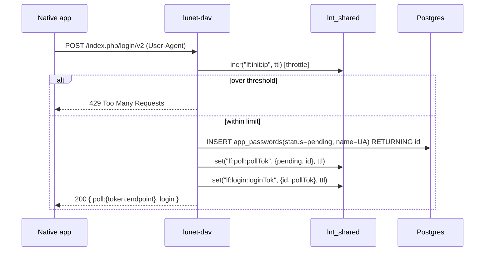
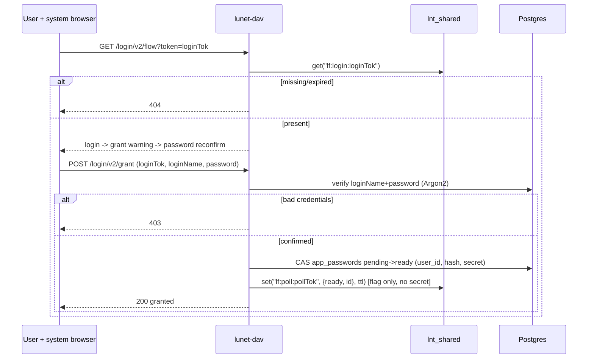
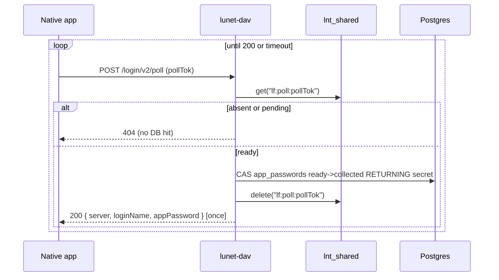

# lunet-dav — Design

A WebDAV server that is a **work-alike** to the file APIs of NextCloud Enterprise 31
(hereafter **nc**), backed by an S3-compatible object store and PostgreSQL 16 for
metadata. Built on the same `lunet` (libuv + LuaJIT coroutine) runtime used by
the original demo app this worktree forked from.

Its purpose today: a **local integration simulator** for iOS / Android / Flutter
desktop clients being developed against a real IONOS-managed nc E31 instance, so those
clients can be tested offline against a faithful subset of the nc WebDAV surface. No
authentication is enforced in v0.1.0 (see §Security). If it matures, it may be published
as a tool that can be pointed at a real S3 with basic security added.

---

## 1. Goals & non-goals

**Goals**
- Faithful nc E31 WebDAV *wire behaviour* for the MVP method set: `OPTIONS`, `PROPFIND`,
  `PUT`, `GET`, `HEAD`, `DELETE`, `MKCOL`, `MOVE`, `PROPPATCH` (tags only).
- Emit the nc-specific response headers clients key off: `OC-Etag`, `OC-FileId`
  (`<padded-id><instance-id>`), `X-OC-MTime: accepted`, `X-Hash-SHA256`.
- Content-addressed, **immutable** object storage with **mandatory** S3 versioning.
- Lowest-common-denominator (LCD) S3 so the same code runs against MinIO, Scaleway
  (MinIO Enterprise), AWS S3, and legacy SAN/NAS S3 gateways.
- Metadata in Postgres with **compare-and-swap (CAS)** concurrency (no multi-statement
  transactions available in the driver) and an append-only op-log.

**Non-goals for v0.1.0** (deliberately *not* boiling the ocean)
- Users / owners / permissions / ACLs / sharing / federation.
- Favourites (needs a user table), comments, locks, previews, quotas (report unlimited).
- Chunked / streaming upload (the `_landing` prefix is designed for it, but not exposed).
- Nested folders. **Only flat, top-level collections** ("team folders") are allowed.
- `COPY` (would create two logical files with one sha256 — unsupported by design).
- Folder zip/tar download, `REPORT`, public shares.

---

## 2. Storage model

### 2.1 Object store (S3, LCD)
- **Versioning is mandatory and non-negotiable.** On startup the server asserts that the
  configured bucket has versioning `Enabled`; it refuses to run otherwise. This gives an
  immutable-semantics store and a get-out-of-jail for accidental overwrites.
- **Content-addressed keys.** A file's bytes are hashed with **SHA-256**; the lowercase
  hex digest is the object key. Identical content therefore collapses to one key
  (natural dedup). The hash is also surfaced as `X-Hash-SHA256` and `oc:checksums` for free.
- **Landing prefix.** All PUTs land under a reserved `_landing/` prefix, e.g.
  `_landing/<sha256>`. This is the seam where future chunked upload will stream, followed
  by a server-side move into a named team-folder prefix. **Not exposed** in v0.1.0.
- **Immutability with an escape hatch.** We treat objects as immutable, but reserve the
  right to overwrite-in-place for accident recovery; the S3 **VersionId** is the escape
  hatch and future version-history surface.

### 2.2 Internal identity vs. nc external identity
Two distinct identifiers, do not conflate:

| Concept              | Value                                   | Used for |
|----------------------|-----------------------------------------|----------|
| **Storage locator**  | `bucket + key(sha256) + s3_version_id`  | fetching exact bytes; immutable version pin |
| **nc file identity** | `files.id` (BIGSERIAL) → `OC-FileId`    | stable inode-like id, survives content change |

`OC-FileId = lpad(id::text, 8, '0') || instance_id`, mirroring the observed nc format
`00000259oczn5x60nrdu`. `id` is a per-instance monotonic counter over all files and
folders (matches the nc counter observed as low as 477). It is **stable across content
overwrites and moves** — an overwrite changes the bytes, sha256, S3 version, etag and
mtime, but keeps the same `id`/`OC-FileId`, exactly like an inode.

### 2.3 ETag
nc etags are opaque quoted strings. We store the S3-returned ETag of the object version
(for single-part PUTs this is the MD5 of the bytes) as `files.etag` and emit it quoted as
`OC-Etag`. It is opaque to clients; content identity is really carried by sha256. This is
the "sensible" choice: no extra hashing, stable per content, and it is a genuine
store-side value rather than an invented one.

---

## 3. PostgreSQL metadata

No client-side multi-statement transactions are used (the `lunet.postgres` driver runs
each `query` independently on the libuv thread pool). Correctness therefore rests on
**single-statement CAS updates** with a version guard and `RETURNING`.

### 3.1 `dav_files` table (see [`../sql/dav_schema.sql`](../sql/dav_schema.sql))
- `id BIGSERIAL PRIMARY KEY` — drives `OC-FileId`; stable identity.
- `is_collection BOOLEAN` — true for a top-level folder (MKCOL), false for a file.
- `collection TEXT` — the top-level team folder name, or `''` for the root.
- `name TEXT` — display name / filename.
- `UNIQUE (collection, name)` — logical path uniqueness (flat namespace).
- `sha256 TEXT` — content hash = object key basename (NULL for collections).
- `s3_bucket`, `s3_key`, `s3_version_id TEXT` — the storage locator.
- `etag TEXT` — S3 ETag, emitted as `OC-Etag`.
- `mime_type TEXT`, `size BIGINT`.
- `version INTEGER NOT NULL DEFAULT 0` — **CAS guard**, bumped on every metadata write.
- `ctime TIMESTAMPTZ DEFAULT now()`, `mtime TIMESTAMPTZ DEFAULT now()` — server-set;
  `mtime` returned by the CAS `RETURNING` clause so callers learn the new value.
- `op_log text[][]` — **2-D text array** (see §3.3), append-only.
- `info JSONB DEFAULT '{}'` — open bag for miscellaneous per-file metadata that must ride
  along under the same CAS.

### 3.2 CAS write pattern
Every mutation reads the current `version`, then:

```sql
UPDATE dav_files
   SET version    = version + 1,
       sha256     = $2, s3_key = $3, s3_version_id = $4, etag = $5,
       size       = $6, mime_type = $7,
       mtime      = now(),
       op_log     = op_log || ARRAY[[ $8, $9, $10, $11 ]]   -- one op row
 WHERE id = $1 AND version = $expected
RETURNING id, version, mtime, etag;
```

Zero rows affected ⇒ someone else won the race ⇒ surface as `412 Precondition Failed`
(and/or bounded retry). New files are `INSERT ... RETURNING`.

### 3.3 The op-log (2-D array, **not** JSONB)
`op_log` is a rectangular `text[][]`; each appended row is exactly four columns:

```
[ ts, who, type, data ]
```

- `ts`   — unix epoch (seconds) of the op, as text.
- `who`  — user performing the write (Basic-auth username; `anonymous` in v0.1.0).
- `type` — op kind: `put`, `mkcol`, `move`, `set-label`, `unset-label`, `rename`.
- `data` — the value that was set (new sha256, destination path, label value, …).

Appended with `op_log || ARRAY[[ts,who,type,data]]` inside the same CAS statement, so the
op-log and the version bump are atomic in one statement. The array is *unbounded in
theory* but bounded in practice (metadata ops only; can be capped in prod). This same
op-log scheme is used elsewhere in the author's systems; the trade-offs are understood.

**Derived state via replay.** Some properties are not stored directly but computed by
replaying the op-log in order:
- **Tags** (`oc:tags`): fold `set-label`/`unset-label` in order into a set. This is the
  authoritative rule for tags — read the array in order and apply.
- Future: collection membership / rename history follow the same replay pattern.

---

## 4. Namespaces & the private `lnt` namespace

We honour the nc namespace prefixes exactly (`d`, `oc`, `nc`, `ocs`, `ocm`) so client XML
round-trips. We add a **private** namespace for debugging:

- URI `http://lunet.stenographer.cloud/ns`, prefix **`lnt`**.
- Exposes internal table state in PROPFIND: `lnt:sha256`, `lnt:s3-version-id`,
  `lnt:cas-version`, `lnt:collection`, and `lnt:oplog` (the full op-log serialised as a
  JSON array of `[ts,who,type,data]` rows, for debugging tag/label replay).
- **Not a stable API.** Explicitly for debugging at this stage; may change or vanish.

---

## 5. Path & namespace rules (flat team folders)

- Base: `/remote.php/dav/files/{user}/...`. `{user}` is taken from Basic auth / path; not
  validated in v0.1.0.
- **Flat only.** A collection is a single top-level segment. Paths of the form
  `/{collection}/{file}` or `/{file}` are allowed; anything deeper is rejected `409`.
- **Reserved prefix.** Names beginning with `_` are reserved for the system
  (`_landing`, future system folders) → `MKCOL` rejected `403`.
- **No slashes in folder names**, no nesting.
- **`COPY` unsupported.** Copying a file would mean two logical rows sharing one sha256,
  which the content-addressed model does not represent → `409 Conflict` with a DAV error
  body (a "400-like" client error), documented as intentional.

---

## 6. S3 compatibility profiles (LCD mode)

Config selects an **API profile** so the server can run in a "fewer features" mode against
old/limited S3 gateways (e.g. the Fujitsu SAN/NAS "cheap and deep" S3 seen at a bank).

- `S3_API_PROFILE=lcd` (default) — only the classic, universally supported operations:
  `PutObject`, `GetObject`, `HeadObject`, `DeleteObject`, `ListObjectsV2`,
  `GetBucketVersioning`, SigV4, path-style addressing.
- `S3_API_PROFILE=minio-latest` — may additionally use newer MinIO-stable features.

Features that are **new** or **MinIO/`mc`-specific** and therefore *gated out of `lcd`*
(noted so we can drop to "less features" mode):
- Object Lock / retention / legal-hold (governance/compliance mode).
- Server-side conditional writes (`If-None-Match: *` on PUT).
- Additional checksum algorithms (CRC32C/CRC64NVME `x-amz-checksum-*`).
- Object tagging (`PutObjectTagging`), `ListObjectVersions` pagination niceties.
- Anything requiring the `mc` admin API.

Versioning enforcement uses `GetBucketVersioning`, which is available even on legacy
gateways; if a gateway cannot report `Enabled`, startup fails (versioning is
non-negotiable) — document the gateway as unsupported.

---

## 7. Deployment & network posture

- Per lunet policy the server runs on **loopback or a unix socket** and is fronted by
  nginx/OpenResty in production to avoid exposing the raw stack.
- For now, a config **interface whitelist** restricts binding to `localhost,127.0.0.1`
  for safety while testing. Non-loopback binds are refused unless the whitelist is widened.

---

## 8. Security (v0.1.0)

- The DAV surface itself is **unauthenticated** in v0.1.0: the Basic-auth header is parsed
  and the username seeds `op_log.who`, but the password is **not** validated. This build is
  a local simulator by design.
- **We keep the demo chassis's user-security machinery** — the `users` table, Argon2
  password hashing (`app/password.lua`), JWT issue/verify (`app/jwt.lua`), and the
  register/login/current-user endpoints (`app/auth_routes.lua`) — as the basis for
  protecting the DAV logic once the core WebDAV behaviour works. What we deliberately drop
  is the *Conduit / Medium-clone* application on top (articles, article tags, favourites,
  the articles feed): none of that returns, and its separate tag/favourite tables competed
  with our single-row atomic-update model.
- **Tags do not use a separate table.** The demo stored article tags in `tags` /
  `article_tags`; our tags live in the `dav_files.op_log` and are derived by replay
  (§3.3). This is the specific reason the demo's tag tables were removed rather than reused.
- The `comments` table is **retained but decoupled** (its `article_id` FK to `articles`
  is dropped, leaving an orphaned column) as a placeholder — NextCloud E31 has file
  comments we do not implement yet. It has no live routes until a file-comments model is
  built; the demo's comment endpoints (article-nested) were removed with the articles code.
- Future: DAV requests gated by JWT verification at the same seam
  `web.get_current_user` occupies in the chassis, plus an IdP / app-password integration.

---

## 9. Testing strategy

- **Red/Green TDD compat suite** in `specs/dav/*.hurl`, run by
  [`../specs/run-dav-tests-hurl.sh`](../specs/run-dav-tests-hurl.sh) — the same Hurl 8.x
  harness the chassis already uses. Of the original chassis suite in `specs/chassis/`, only
  the auth/profiles tests survive (`auth.hurl`, `errors_auth.hurl`, `profiles.hurl`,
  `errors_profiles.hurl`); the article-domain tests were removed with the articles code.
- Tests assert nc wire behaviour: status codes, `OC-Etag`/`OC-FileId` shapes, `207`
  multistatus XML (matched via `xpath` `local-name()` to sidestep namespace binding),
  and the tag-replay and `lnt:oplog` debug output.
- The suite is **RED** until the server is implemented; that is intentional and defines
  the compatibility contract for v0.1.0.
- Full unit-test-suite design (unit + hurl inventory) lives in [`TEST-PLAN.md`](TEST-PLAN.md).

---

## 10. OCS user metadata & Login Flow v2

Two auth-adjacent surfaces round out the feature set used against the author's NC E31
instance. Both are **scaffolding**; both reuse the residual `users` table and the chassis
Argon2 (`app/password.lua`).

### 10.0 `lunet.lnt_shared` — lunet's native shared store
The feature tracked as [lunet#103](https://github.com/lua-lunet/lunet/issues/103) has
landed upstream (v0.4.3, renamed from `ngx_shared` to **`lnt_shared`** — `lnt` = lunet,
standardized as the project's TLA prefix). It is `require("lunet.lnt_shared")`, an
ngx.shared-style in-process shared dict (mmap-backed, survives across coroutines in the
same process) with `open`/`store`, `:get`/`:set`/`:add`/`:replace`/`:delete`/`:incr`/
`:expire`/`:ttl`/`:flush_all`/`:flush_expired`, all with a TTL.

It is **not** part of the prebuilt release tarballs (only `lunet-run`/`lunet.so` and the
`ext/` drivers with an xmake target are — see `.github/workflows/build.yml`), so we still
build it from source: a small, fast (~seconds) `cargo build --release` of `ext/lnt_shared`,
producing `liblnt_shared.{so,dylib}` + `lnt_shared.lua`, vendored into `bin/lunet/` alongside
the release-provided `postgres.so`.

Values are natively strings/numbers/booleans only (no tables) — our Login Flow v2 state is
a small Lua table, so `app/nc31.lua` JSON-encodes/decodes at the store boundary
(`store_set_json`/`store_get_json`). `store_get_json` also translates the store's
`nil, "not found"` into `nil, nil` to match how call sites expect an absent key to read.

Why a separate store at all: transient Login Flow v2 state (polling status for flows that
may never complete) must **not** hit Postgres — it would be DB pressure for buggy or
abandoned clients. `lnt_shared` absorbs that with a TTL matching the flow timeout.

### 10.1 App passwords (`app_passwords` table)
A separate table from `users` so an app credential can be **revoked independently** of the
real password. The row also carries the Login Flow v2 lifecycle via single-row CAS
(`pending → ready → collected`). Only an Argon2 hash (`password_hash`) is durable; the
one-time plaintext (`secret`) lives in the row **only between `ready` and `collected`** and
is nulled on collection. Basic auth resolves a user by `loginName` then Argon2-verifies the
presented app password against that user's `collected` rows.

### 10.2 Login Flow v2 (`lnt_shared` for transient state + `app_passwords` for the lifecycle)
System-browser app-password minting with a strict split: the shared store holds
token→status (TTL); `app_passwords` holds the durable credential and its CAS lifecycle. The
poller reads **only the shared store** until a flow is `ready`, so incomplete flows never
touch the DB. The plaintext secret is **never** placed in the shared store. **No web UI
exists yet** (the Conduit screens were never wired up), so the browser page is specified as
a contract but stubbed/deferred at build time; the discrete grant endpoint is a scaffolding
choice so the future page and the hurl tests have a concrete call.

Init throttling is best-effort via the shared store's `:incr` keyed by client IP (init is
anonymous, so there is no user to enforce single-flight on). We accept that abuse can leave
abandoned `pending` rows and "soak it up" rather than do per-user bookkeeping — a flagged
scaffolding decision.

#### Sequence — initiate


#### Sequence — browser grant (user does the slow part)


#### Sequence — poll (client waits; DB touched only when ready)


### 10.3 OCS (`/ocs/v2.php/cloud/...`)
Minimal: `GET /cloud/user` (own details) and `GET /cloud/users/{userid}` (self only; any
other id → 403, since no admin role exists). We emit only the fields sourceable from
`users` — `id`/`display-name` = username, `email`, `enabled`, and an unlimited `quota`
placeholder. Requires `OCS-APIRequest: true` and `?format=json`; the OCS v2 envelope wraps
every response and the HTTP status mirrors `ocs.meta.statuscode`.
